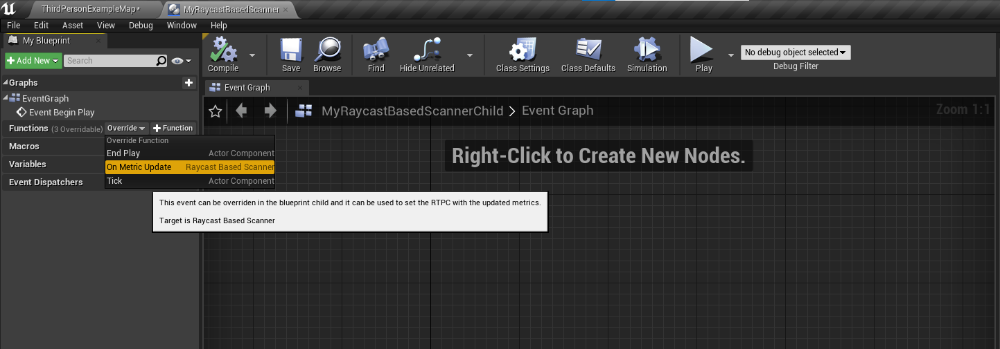
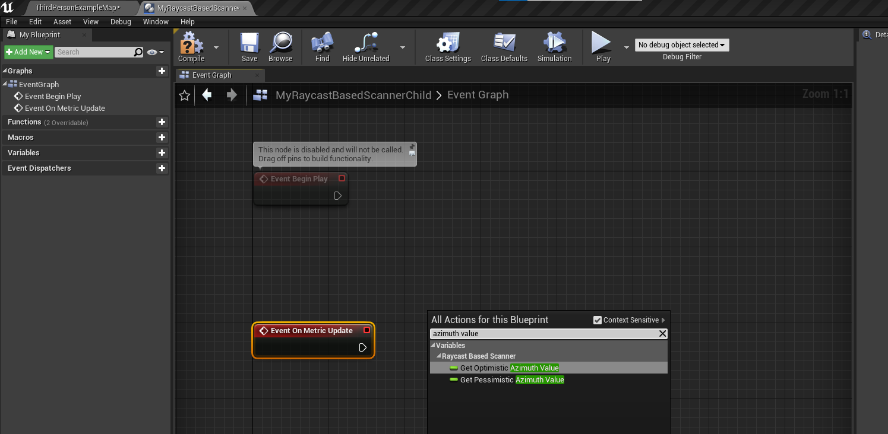

# RaycastScanner
Real-time geometry-based raycast system made in 4.26


 
## Video
https://vimeo.com/557077663
 
## Description

This is an attempt to recreate a Snowdrop Core Module called "BubbleSpace" in Unreal using C++.

It's an Actor Component that returns an average of the width around the player. It has both an Optimistic Metric and a Pessimistic Metric.
It can be used by Sound Designers to switch between ambiances, weather, weapon tails, modify parameters in real-time (for example reverb parameters).

Click here for more info about the original Bubblespace:
https://www.youtube.com/watch?v=mN56EauPhPQ&t=765s&ab_channel=GDC

DISCLAIMER:
I'm using built-in array instead of TArrays because I am working on optimising the tool using SIMD intrinsics.


## Supported Engine Versions
4.26 

## How to install the Plugin 
After you download the repository, extract the zip archive. Your Project can be either a C++ Project or a Blueprint Project. 

Copy the folders "RaycastScannerPlugin" into the "Plugins" folder of your UE4 project. 

If you don’t have a Plugins folder in your project folder yet, just create one.

You will be able to see it in the Editor only if you toggle the "Show Plugin Content" on the "View Options".


## How to use the Plugin
There are two ways of using this tool. If you are comfortable with C++ you can simply use the C++ Actor Component, otherwise you can create a Blueprint class from the C++ Actor Component and script your logic with blueprint.

### Using the C++ Actor Component
Modify the code to add your own logic. My suggestion would be to set an RTPC everytime the metric is updated (every 16 frames).
```
// TRUE if four completed phases have been completed
if (PhaseCounter >= 4)
{
	(...)

	// TRUE if 16 frames have passed
	if (FrameCounter >= 4)
	{
		// metrics are updated
		(...)
		// Set the RTPC with the updated metrics
	}
}	
```

Go to your Character Bluperint. On the Components tab, click the Add Component button in the Components window.

Click Raycast Based Scanner to add the Component and notice that the Details window is populated below the Components window.

### Using a Blueprint Class
This will allow you to add your unique blueprint logic to the Raycast Based Scanner.

Right click on the C++ Actor Component and select "Create Blueprint Class based on "Raycast based scanner". 

Choose a name and a directory for your Blueprint class.

Open your new Blueprint class and override the function "OnMetricUpdate".



Get the pessimistic and optimistic metric.



Set the RTPC on the OnMetricUpdate event. Compile the Blueprint Class.

Go to your Character Bluperint. On the Components tab, click the Add Component button in the Components window.

Click the new Blueprint Class that you have created to add the Component and notice that the Details window is populated below the Components window.


### Modifying the parameters
Once you have added the component (either the C++ Actor component or the Blueprint class component) you can modify the parameters of the tool in the details window.


#### Range: 


## How to contact me
For any feedback please send me an email: 
luigiplatania94@gmail.com

My website: https://www.luigiplatania.net/
